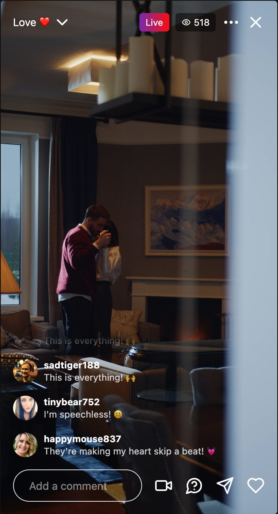

# Tela de Transmissão ao Vivo do Instagram

Este projeto é uma tela de transmissão ao vivo simulada do Instagram, onde os usuários podem assistir a uma transmissão ao vivo e interagir através de comentários.

## Tecnologias Utilizadas

Este projeto foi desenvolvido utilizando as seguintes tecnologias:

- **React com Vite**.
- **useState**.
- **useCallback**.
- **useEffect**.
- **Tailwind CSS**.
- **lucide-react**.
- **fetch API**.
- **Shadcn**.

## Funcionalidades

- Transmissão ao vivo reproduzindo um vídeo.
- Comentários dos usuários atualizados automaticamente a cada 5 segundos.
- Remoção automática de comentários antigos quando a lista de comentários excede 10 itens.
- Exibição do número de usuários assistindo à transmissão ao vivo.

Vídeo de cottonbro studio: (https://www.pexels.com/pt-br/video/velas-lamparinas-casal-conjuges-6262593)
